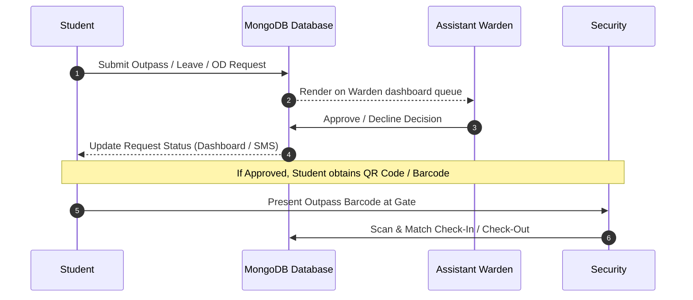
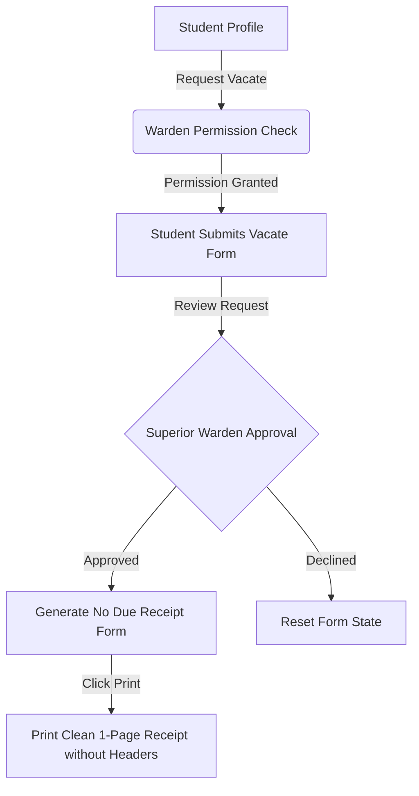
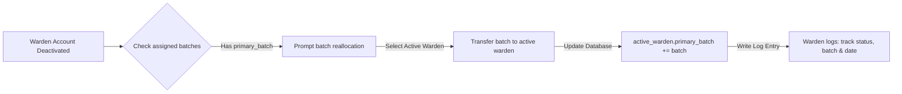

# Digital Hostel Management System


<p align="center">
  <a href="https://react.dev/">
    
  </a>
  <a href="https://nodejs.org/">
    
  </a>
  <a href="https://expressjs.com/">
    
  </a>
  <a href="https://www.mongodb.com/">
    
  </a>
  <a href="https://aws.amazon.com/s3/">
    
  </a>
  <a href="https://opensource.org/licenses/MIT">
    
  </a>
</p>

An enterprise-grade, role-based hostel management platform designed to automate operations, manage student outpasses via barcode checkout workflows, process hostel vacate forms, dynamically reallocate warden student batches, and track food preferences in real-time.

---

## 🗺️ Workflows & Architecture

### 1. Student Outpass Lifecycle


### 2. Hostel Vacating & No-Due Flow


### 3. Warden Deactivation & Batch Reallocation


---

## ✨ Features Breakdown

### 📱 Student Portal
- **Smart Outpass Form:** Dynamic date/time range validators enforcing IST timezone synchronization and checking checkout policies.
- **Unified Vacate Request:** Integrated workflow checks if the Warden has granted vacate permission, handles superior warden approvals, and allows printing a bordered No Due Form receipt with zero browser headers/footers.
- **Dynamic Food Preference:** Toggles food preferences between **Veg** and **Non-Veg**, updating mess projections instantly.

### 📋 Warden Portal
- **Live Approval Dashboard:** Process pending leave and food preference requests for assigned batches.
- **Mess Monitoring:** Consolidated counts of active diners categorized by year and gender.
- **Student Tracker:** View active student directory details and mark students as vacated.

### 👑 Superior Warden Portal
- **Warden Management:** Perform CRUD operations on wardens, upload optimized profile photos (Sharp conversion to WebP), and toggle active statuses.
- **Batch Reallocations:** Safely transfer students to active wardens on deactivation to prevent orphaned batches.
- **Real-Time Analytics:** Interactive Recharts charts detailing pass distributions, average return delays, and student attendance logs.

### 🛡️ Security Desk
- **Campus Gate System:** Quick barcode reader interface to log check-in and check-out events directly.

---

## ⚙️ Configuration & Environment Setup

### Prerequisites
- Node.js (v18+)
- MongoDB Community Server

### Backend Configuration (`Backend/.env`)
```env
PORT=5000
MONGO_URI=mongodb://127.0.0.1:27017
DB_NAME=VEC

CLIENT_URL=http://localhost:3000
NODE_ENV=development

# AWS S3 Storage
AWS_ACCESS_KEY_ID=your_aws_access_key
AWS_SECRET_ACCESS_KEY=your_aws_secret_key
AWS_BUCKET_NAME=your_aws_bucket_name
AWS_REGION=ap-south-1

# Express Session
SESSION_SECRET=your_long_session_secret_hash
```

### Frontend Configuration (`Frontend/.env`)
```env
REACT_APP_QR_URL=https://your_aws_bucket_name.s3.ap-south-1.amazonaws.com
REACT_APP_BASE_URL=http://localhost:5000
```

---

## 🛠️ Installation & Quickstart

### 1. Start the API Backend
```bash
cd Backend
npm install
npm start
```
Server runs at `http://localhost:5000`.

### 2. Start the Frontend Client
```bash
cd Frontend
npm install
npm start
```
Client runs at `http://localhost:3000`.

---

## 🔗 Key API Routes

### Authentication
- `POST /api/login` - Authenticate user session
- `POST /api/logout` - Clear user session

### Student Operations
- `POST /api/verify_student` - Verify student existence via mobile number
- `POST /api/submit_vacate_form` - Submit vacate request
- `POST /api/get_student_pass_by_passid` - Fetch pass details

### Warden Operations
- `GET /api/sidebar_warden` - Fetch session details for active warden
- `GET /api/fetch_passes_` - Retrieve student outpasses by date/year
- `POST /api/warden_decision` - Approve or reject outpass requests
- `POST /api/approve_food_change` - Handle food preference change approvals

### Superior Warden Operations
- `GET /api/fetch_warden_details` - Fetch list of wardens
- `POST /api/add_warden` - Create a new assistant warden profile
- `POST /api/update_warden_by_superior` - Edit warden details
- `POST /api/warden_inactive_status_handling` - Deactivate warden and reallocate student batches
- `POST /api/warden_active_status_handling` - Reactivate warden
- `GET /api/fetch_logs` - Fetch deactivation activity logs
- `GET /api/fetch_student_details_superior` - View student database records
- `POST /api/increment_student_year` - Promote student batches
- `POST /api/delete_student` - Remove student profile
